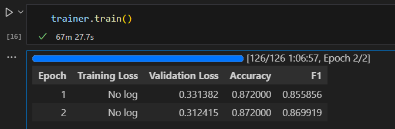

1. ***Step 1***: Load the IMDb dataset using the `datasets` library.

```python
dataset = load_dataset("imdb")

small_train = dataset["train"].shuffle(seed=42).select(range(1000))  # 1k samples
small_test = dataset["test"].shuffle(seed=42).select(range(250))     # 250 samples
``` 
The IMDb dataset comes pre-labeled with 25K positive/negative reviews. Reducing the sample size since my python version incompatible for CUDA n its a drag to downgrade now:)

2. ***Step 2:***: Tokenize with BERT tokenizer

```python
tokenizer = BertTokenizer.from_pretrained("bert-base-uncased")

def tokenize(batch):
    return tokenizer(batch["text"], padding="max_length", truncation=True, max_length=512)

tokenized_dataset_train = small_train.map(tokenize, batched=True)
tokenized_dataset_test = small_test.map(tokenize, batched=True)
```
BERT needs text converted to numerical IDs. We use BertTokenizer to split text into subwords and pad/truncate sequences.
Returns input_ids (token IDs) and attention_mask (to ignore padding). This matches the exact vocabulary and subword rules BERT was trained with.

3. ***Step 3:*** Prepare model for binary classification

```python
model = BertForSequenceClassification.from_pretrained("bert-base-uncased", num_labels=2)
```

4. ***Step 4:*** Define metrics (accuracy & F1)
```python
metric = load_metric("accuracy")

def compute_metrics(eval_pred):
    logits, labels = eval_pred
    predictions = np.argmax(logits, axis=-1)
    return metric.compute(predictions=predictions, references=labels)
```
We use `load_metric` to get accuracy and F1 score. The `compute_metrics` function takes model predictions and labels, calculates accuracy, and returns it.<br>
The function compute_metrics converts model outputs (logits) into predicted classes.
It then calculates the accuracy of these predictions against the true labels.

5. ***Step 5:*** Training setup

```python
training_args = TrainingArguments(
    output_dir="./results",
    eval_strategy="epoch",
    learning_rate=2e-5,
    per_device_train_batch_size=16,
    num_train_epochs=2,
    save_strategy="epoch",
    load_best_model_at_end=True,
)

trainer = Trainer(
    model=model,
    args=training_args,
    train_dataset=tokenized_dataset_train,
    eval_dataset=tokenized_dataset_test,
    compute_metrics=compute_metrics,
)
```

The model trains for 3 epochs on the training data.
After each epoch, it evaluates on the test dataset and computes accuracy, f1.
It saves the model checkpoint at the end of each epoch.
At the end of training, it loads the best model checkpoint based on evaluation accuracy and f1.

Training Output:
```bash
TrainOutput(global_step=126, training_loss=0.41880531916542657, metrics={'train_runtime': 4047.0763, 'train_samples_per_second': 0.494, 'train_steps_per_second': 0.031, 'total_flos': 526222110720000.0, 'train_loss': 0.41880531916542657, 'epoch': 2.0})
```


6. ***Step 6***: Train
```python
trainer.train()
```

7. ***Step 7***: Save the model
```python
model = BertForSequenceClassification.from_pretrained("E:/IITB/Learner Space 2025/Intro-to-ML-and-NLP/results/checkpoint-126")
tokenizer = BertTokenizer.from_pretrained("bert-base-uncased")

model.save_pretrained("E:/IITB/Learner Space 2025/Intro-to-ML-and-NLP/fine_tuned_bert")
tokenizer.save_pretrained("E:/IITB/Learner Space 2025/Intro-to-ML-and-NLP/fine_tuned_bert")
```

8. ***Step 8***: Test inference
```python
sample_text = "This movie was fantastic!"
pipe = pipeline("text-classification", model=model, tokenizer=tokenizer)
print("Sample prediction:", pipe(sample_text)) # Label_1: Positive, Label_0: Negative
```