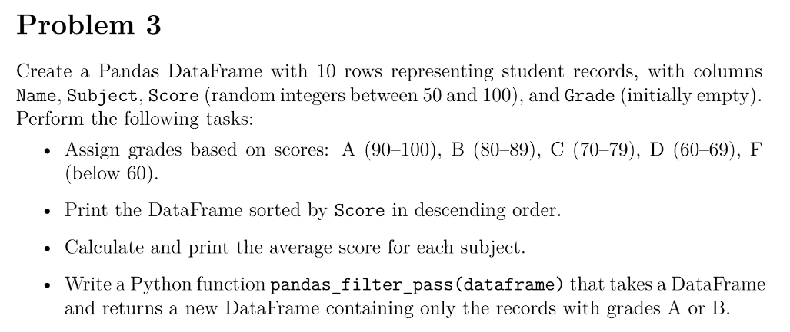
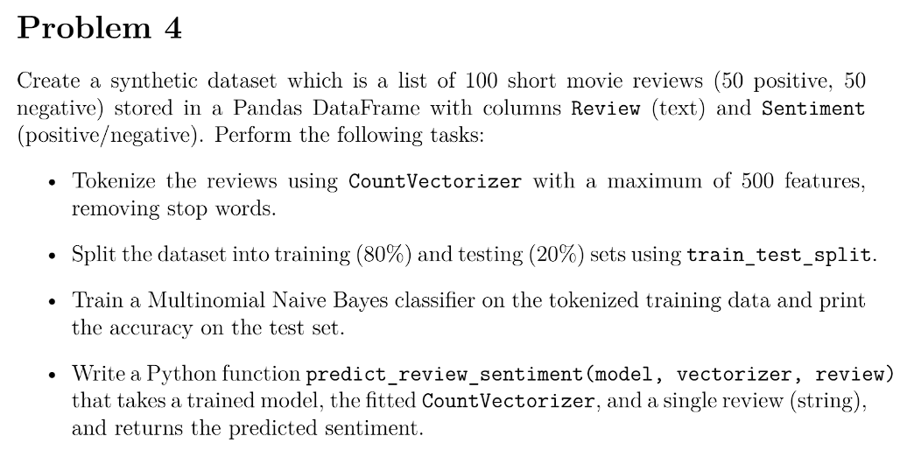
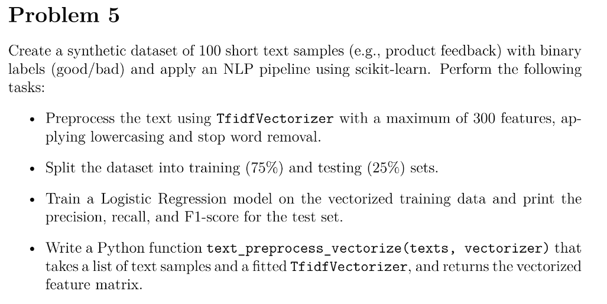

## functions used:
1. `numpy.random.randint()` generates random integers.
    [Reference](https://numpy.org/doc/stable/reference/random/generated/numpy.random.randint.html)
2. `numpy.max(arr, axis=1)` returns the maximum value from each row of the array.
    [Reference](https://numpy.org/doc/stable/reference/generated/numpy.max.html)
3. `list.append()` adds an element to the end of a list.
    [Reference](https://www.w3schools.com/python/ref_list_append.asp)

Note: One thing i noticed is that since am using numpy arrays, the data type is particularly np.int32, which is the same as int. So just so it looks clean I casted it to int before appending to the list.

## functions used:
1. `numpy.random.uniform()` generates random floats in a specified range.
    [Reference](https://numpy.org/doc/stable/reference/random/generated/numpy.random.uniform.html)
2. `numpy.round(arr, 2)` rounds the elements of an array to a specified number of decimal places.
    [Reference](https://numpy.org/doc/stable/reference/generated/numpy.round.html)

Note: Similar to the first problem, I used numpy arrays and casted the values to float before appending them to the list.

