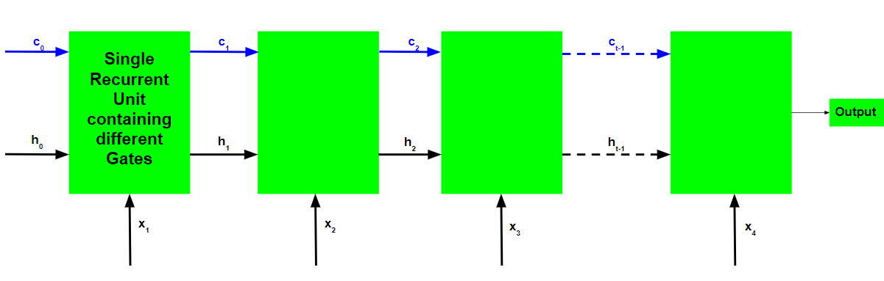

# Long Short Term Memory Networks (LSTMs)

Reference: [LSTM by GFG](https://www.geeksforgeeks.org/machine-learning/long-short-term-memory-networks-explanation/)

To solve the problem of Vanishing and Exploding Gradients in a Deep Recurrent Neural Network, many variations were developed. One of the most famous of them is the Long Short Term Memory Network(LSTM). In concept, an LSTM recurrent unit tries to "remember" all the past knowledge that the network is seen so far and to "forget" irrelevant data. This is done by introducing different activation function layers called "gates" for different purposes. Each LSTM recurrent unit also maintains a vector called the Internal Cell State which conceptually describes the information that was chosen to be retained by the previous LSTM recurrent unit.

LSTM networks are the most commonly used variation of Recurrent Neural Networks (RNNs). The critical component of the LSTM is the memory cell and the gates (including the forget gate but also the input gate), inner contents of the memory cell are modulated by the input gates and forget gates. Assuming that both of the segue he are closed, the contents of the memory cell will remain unmodified between one time-step and the next gradients gating structure allows information to be retained across many time-steps, and consequently also allows group that to flow across many time-steps. This allows the LSTM model to overcome the vanishing gradient properly occurs with most Recurrent Neural Network models.

A Long Short Term Memory Network consists of four different gates for different purposes as described below:- 

1. ***Forget Gate(f)***: At forget gate the input is combined with the previous output to generate a fraction between 0 and 1, that determines how much of the previous state need to be preserved (or in other words, how much of the state should be forgotten). This output is then multiplied with the previous state. Note: An activation output of 1.0 means "remember everything" and activation output of 0.0 means "forget everything." From a different perspective, a better name for the forget gate might be the "remember gate"

2. ***Input Gate(i)***: Input gate operates on the same signals as the forget gate, but here the objective is to decide which new information is going to enter the state of LSTM. The output of the input gate (again a fraction between 0 and 1) is multiplied with the output of tan h block that produces the new values that must be added to previous state. This gated vector is then added to previous state to generate current state

3. ***Input Modulation Gate(g)***: It is often considered as a sub-part of the input gate and much literature on LSTM's does not even mention it and assume it is inside the Input gate. It is used to modulate the information that the Input gate will write onto the Internal State Cell by adding non-linearity to the information and making the information Zero-mean. This is done to reduce the learning time as Zero-mean input has faster convergence. Although this gate's actions are less important than the others and are often treated as a finesse-providing concept, it is good practice to include this gate in the structure of the LSTM unit.

4. ***Output Gate(o)***: At output gate, the input and previous state are gated as before to generate another scaling fraction that is combined with the output of tanh block that brings the current state. This output is then given out. The output and state are fed back into the LSTM block.

The basic workflow of a Long Short Term Memory Network is similar to the workflow of a Recurrent Neural Network with the only difference being that the Internal Cell State is also passed forward along with the Hidden State. 

Learn more on [GNU-RNN](https://youtu.be/tOuXgORsXJ4?si=Cv2JxQQip_lmi40h)

