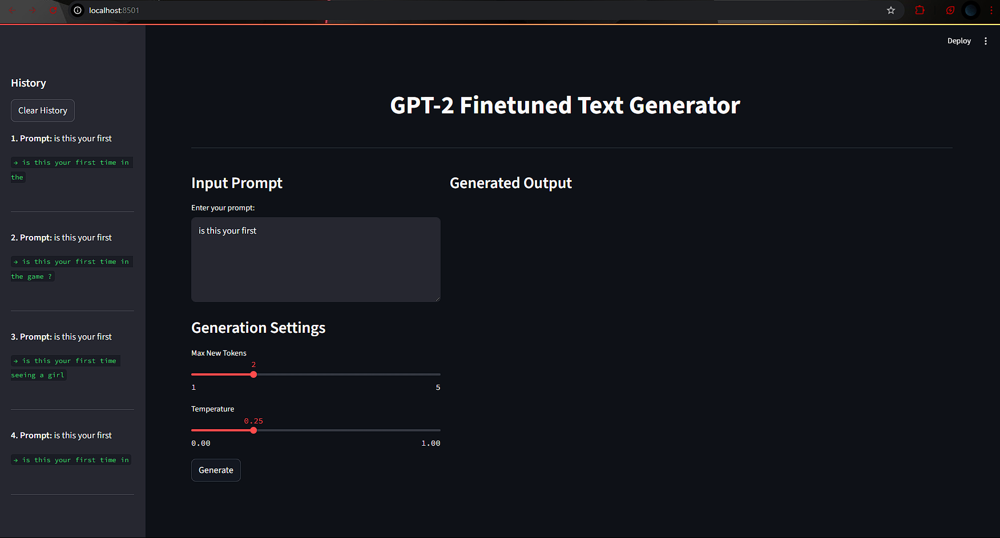
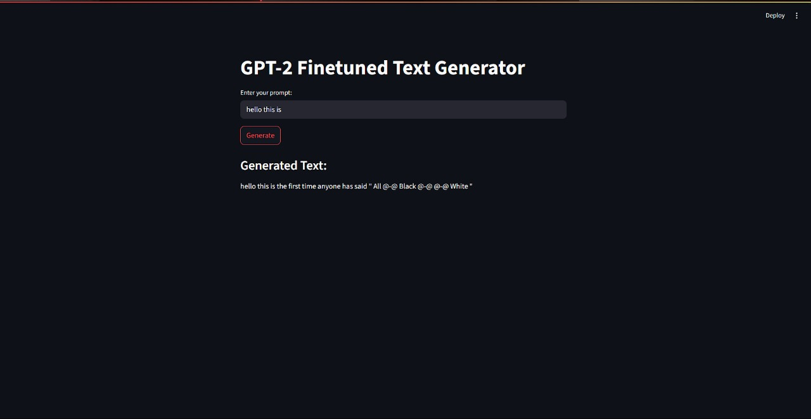

# Problem Statement

Design and train a transformer-based language model to predict the next word in a given text sequence. This task is foundational in NLP and supports applications such as autocomplete, text generation, and intelligent writing assistants.

## Objectives

1. Build a language model for next-word prediction using transformer architecture.
2. Fine-tune a pre-trained model (e.g., GPT-2) on a textual dataset.
3. Evaluate the model using standard metrics like perplexity and top-k accuracy.
4. Understand and apply best practices for tokenizer alignment, model adaptation, and text preprocessing.

## Datasets

1. General Text Corpora:
   - WikiText-2: Clean Wikipedia articles suitable for structured language learning.
   - OpenWebText: Large-scale web data similar to GPT-2’s pretraining corpus.
2. Domain-Specific Data (Optional):
   - Custom datasets such as academic papers, technical documentation, or support dialogues can be used for specialized modeling.

## Training Steps

1. Data Loading & Tokenization: Load your dataset with `datasets` and tokenize it using `AutoTokenizer`.
2. Model Selection: Use a pretrained model `GPT2LMHeadModel` for next-word prediction.
3. Fine-Tuning: Train the model using the Trainer API or a custom PyTorch loop.
4. Evaluation: Measure performance with the metrics perplexity and top-k accuracy.

## Optional Extensions

1. Explore larger transformer variants for improved accuracy (e.g., gpt2-medium, gpt2-large).
2. Deploy the model with a basic interface using Streamlit or Gradio for interactive demonstrations.
3. Compare transformer-based performance with a baseline LSTM model.

## Explanation of the Code

Refer to [final_project](./final_project.ipynb) for the training snippet.

NOTE: Trained model has been saved locally and hence unable to share the model weights. You can run the code in this file to train the model on your local machine.

### 1. Loading the Dataset

 [`Datasets`](https://huggingface.co/docs/datasets/en/index): Datasets is a library for easily accessing and sharing datasets for Audio, Computer Vision, and Natural Language Processing (NLP) tasks.

See all the datasets available on the [Hugging Face Hub](https://huggingface.co/datasets).

```python
from datasets import load_dataset_builder
ds_builder = load_dataset_builder("sample-dataset")
```

This helps us to load a dataset builder and inspect a dataset’s attributes without committing to downloading it.

```python
ds_builder.download_and_prepare()
ds = ds_builder.as_dataset
```

* ***`split`***:  A split is a specific subset of a dataset like train and test. List a dataset’s split names with the `get_dataset_split_names()` function. Not using `split` returns a DatasetDict object instead.


### 2. Loading Pre-trained Model and Tokenizer

[`Transformers`](https://huggingface.co/docs/transformers/index): Transformers is a library for state-of-the-art Natural Language Processing for TensorFlow 2.0 and PyTorch.

```python
from transformers import GPT2LMHeadModel, AutoTokenizer

model = GPT2LMHeadModel.from_pretrained("openai-community/gpt2")
tokenizer = AutoTokenizer.from_pretrained("openai-community/gpt2")
# This loads the pre-trained GPT-2 model and its tokenizer.
```

About the Model: [GPT-2](https://huggingface.co/openai-community/gpt2) is a transformers model pretrained on a very large corpus of English data in a self-supervised fashion. This means it was pretrained on the raw texts only, with no humans labelling them in any way (which is why it can use lots of publicly available data) with an automatic process to generate inputs and labels from those texts. More precisely, it was trained to guess the next word in sentences. This is the smallest version of GPT-2, with 124M parameters.<br>
Also, something interesting I found about GPT-2, [here](https://huggingface.co/openai-community/gpt2#limitations-and-bias).

### 3. Tokenization

```python
tokenizer.pad_token = tokenizer.eos_token  # Set the pad token to the end of sentence token

def tokenize(examples):
    return tokenizer(examples["text"], max_length=256, padding="max_length", truncation=True) # shorter lengths means smaller tensors and faster training, but also less context for the model to learn from.

tokenized_dataset = ds.map(tokenize, batched=True)
```

### 4. Training the Model

I am using the [`Trainer`](https://huggingface.co/docs/transformers/main_classes/trainer) API for training.

* `data_collator`: This is used to collate the data into batches. For language modeling, we typically use `DataCollatorForLanguageModeling` which handles padding and masking for the model. MLM (Masked Language Modeling) is for BERT-style models, where you randomly hide words to predict.

* `TrainingArguments`: This is where you specify the training parameters like output directory, evaluation strategy, number of epochs, batch size, and learning rate.

```python
from transformers import Trainer, TrainingArguments, DataCollatorForLanguageModeling

data_collator = DataCollatorForLanguageModeling(
    tokenizer=tokenizer, mlm=False
)

training_args = TrainingArguments(
    output_dir="./NWP_final_results",
    eval_strategy="epoch",
    num_train_epochs=2,
    per_device_train_batch_size=4,
    gradient_accumulation_steps=8,
    learning_rate=5e-5,
    fp16=True,
)

trainer = Trainer(
    model=model,
    args=training_args,
    train_dataset=tokenized_dataset["train"],
    eval_dataset=tokenized_dataset["validation"],
    data_collator=data_collator,
)

trainer.train()
```

### 5. Saving the Model

```python
model.save_pretrained("./gpt2-finetuned-nwp-final")
tokenizer.save_pretrained("./gpt2-finetuned-nwp-final")
```

### 6. Evaluation

Evaluation has been implemented in the file [evaluation.ipynb](evaluation.ipynb). The evaluation metrics used are perplexity and top-k accuracy.

### 7. Streamlit App

Finally I made it interactive using Streamlit. The app allows users to input a prompt and generate text. Here is a screenshot of the app:




P.S- I do think since I trained it on few token size, it is not good at generating tokens of length more than 7-8 (start of the sentence makes sense but then doesnt), lol. Here is an example: (ui looks different since this was my first iteration using the streamlit)


